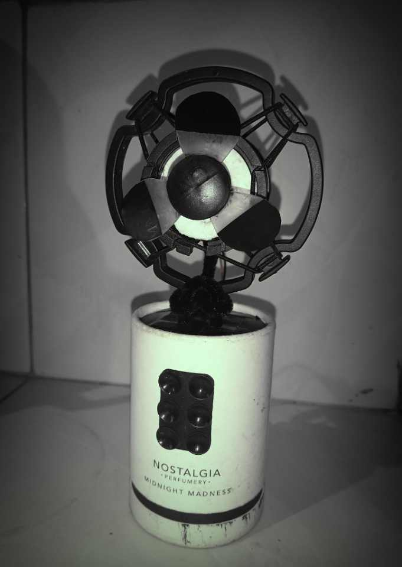

# SMART CLAP FAN CONTROL 👏🌀

A simple Arduino-based smart fan system that changes fan speed using clap sounds detected by a sound sensor.

⭐ DIY SMART CLAP FAN ⭐

  

## Project Overview

This project uses:

- Arduino Uno
- Sound Sensor
- L298N Motor Driver
- DC Motor / Fan
- LEDs

The fan changes speed whenever a clap sound is detected.

The project demonstrates:

- sound detection
- motor speed control
- automation using Arduino

## 🚀 Features

- Clap-controlled fan
- 3 speed levels
- LED speed indicators
- Adjustable sound sensitivity
- Noise filtering
- Stable clap detection

## 🛠 Components Used

| Component           | Quantity |
| ------------------- | -------- |
| Arduino Uno         | 1        |
| Sound Sensor Module | 1        |
| L298N Motor Driver  | 1        |
| DC Motor / Fan      | 1        |
| Green LED           | 1        |
| Yellow LED          | 1        |
| Red LED             | 1        |
| Jumper Wires        | Several  |
| Breadboard          | 1        |
| Power Supply        | 1        |

## ⚡ Speed Levels

| Speed   | LED Indicator |
| ------- | ------------- |
| Speed 1 | Green LED     |
| Speed 2 | Yellow LED    |
| Speed 3 | Red LED       |
